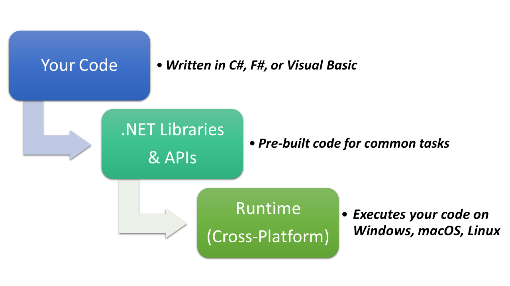

# Unified Modeling Language (UML) and C# Programming:
Learning about C# essentials with the use of Unified Modeling Language (UML).


# What is .NET?
.NET is a free, open-source, cross-platform development platform created by Microsoft:
1. Free:
    - You don't have to pay anything to use .NET. All the tools, languages, and libraries are completely free.
2. Open-source:
    - The code for .NET is publicly available. This means anyone can see how it works, suggest changes, or even contribute improvements.
    - Example: Developers from around the world can submit “pull requests” to improve .NET features or fix bugs.
3. Cross-platform:
    - .NET runs on Windows, macOS, and Linux. This flexibility allows developers to create apps that work on different operating systems without rewriting code.
4. Development platform:
    - A platform is basically a workspace with programming languages and libraries. In .NET, you have access to multiple languages and tools to build various applications.

When we put it all together, .NET is a free development environment where developers can build applications for different platforms using the same code base.

# Languages and Tools in .NET:
Notice for more details about downloading and installing .NET, setup and running your first project, please refer to my PDFs in our LMS. In these quick demo series, we will use GitHub Codespaces so nothing to download or install locally.

## Supported Programming Languages:
- C# – an object-oriented language, widely used for web, desktop, and mobile apps.
- F# – a functional programming language, often used for mathematical or data-heavy applications.

**For more official details, visit [.NET Programming Languages](https://dotnet.microsoft.com/en-us/languages)**

## Recommended Tools (IDEs):
- [Visual Studio Code](https://code.visualstudio.com/): Lightweight and flexible code editor, easy to set up for C#.
- [Visual Studio](https://visualstudio.microsoft.com/): Full-featured IDE, more advanced, great for bigger projects.

# What Can You Build with .NET?
.NET is versatile. You can build:
- Web apps and web services – example: websites or APIs
- Desktop applications – example: Windows apps
- Mobile apps – apps that run on iOS and Android
- Cloud-native applications – apps designed to run in the cloud
- IoT applications – software for smart devices
- APIs – interfaces that allow other programs to interact with your application

**Thinking:** Think of .NET as a toolbox. It has all the tools you need to build almost any type of software, whether it's a website, a mobile game, or a smart home device.

# .NET vs .NET Framework:
You may have heard of .NET Framework. While it sounds similar, there are important differences:

| Feature           | .NET Framework        | Modern .NET                                     |
| ----------------- | --------------------- | ----------------------------------------------- |
| Platform (OS)     | Windows only          | Cross-platform (Windows, Linux, macOS)          |
| Open-source       | Source code available | Open-source + community contributions           |
| Application types | Limited               | Supports web, mobile, desktop, cloud, IoT, APIs |
| Updates           | Bundled with Windows  | Standalone updates                              |
| Recommendation    | Only for old projects | Recommended for all new projects                |

**Tip:** 
If you are starting a new project, always use modern .NET.
- .NET Framework: v4.8.1 or lower (only for legacy projects)
- Modern .NET: v5 and above (latest is .NET 8, recommended)

**For more official details, visit [What is .NET Framework?](https://dotnet.microsoft.com/en-us/learn/dotnet/what-is-dotnet-framework)**

# How .NET Fits Together
A simple diagram to demonstrate the idea of .NET process:


# Setup Your Environment and First Project Using VS Code:
Install the required C# extensions and .NET from Microsoft (just search for C#)
## Creating a New Project:
### Way#1 - Using VS Code Commands:
- CTRL in Windows (Command in Mac) + SHIFT + P => Select/type: **".NET New Project"**
- From the Dropdown list, Select "Console App Common, Console" or simple **"Console App"**
- Type the project name which also be the folder name, example "ConsoleApp1"
    - Notice by convention we use **PascalCase** with **no spaces**
- By default the project will be created inside a separate folder (sub-folder) inside your current repo

### Way#2 - Using VS Code Terminal (DOT NET Commands):
- Refer to my PDF for more details.

**NOTES:** 
- You can create multiple separate projects for different classes/topics within the same repo.

# Run Your Application:
You can run your application by using either from the following ways:
- Click the "Run Project" button for the current active project
- Type the following command in the terminal for for the current active project
    ```
    dotnet run
    ```
    **NOTE: Using simple Linux commands to navigate into any project folder, then use the run command :-)**

    ```bash
    cd .. # exit the current directory (one level up)
    cd ProjectFullName # going inside the wanted project folder
    ```

# References, Resources, and Credits:
- Microsoft:
    - https://dotnet.microsoft.com/en-us/
    - https://learn.microsoft.com/en-us/dotnet/
    - https://dotnet.microsoft.com/en-us/learn/dotnet/hello-world-tutorial/intro
- My GitHub Repositories:
    - `csharp-essentials`
        - https://github.com/anmarjarjees/csharp-essentials
    - `dotnet-csharp-intro`
        - https://github.com/anmarjarjees/dotnet-csharp-intro